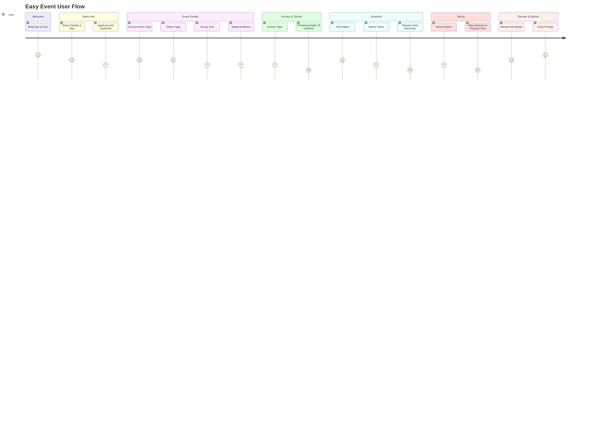

# Easy Event — Documentation & Walkthrough

Welcome to the **Easy Event** documentation! This project is a modern, highly interactive event proposal platform built entirely in the browser. It guides users through a beautiful, multi-step journey to create and submit community event applications — no backend required! All data is handled in the browser session, with a playful, elegant interface and slick navigation.

Below you'll find a walkthrough of each code file and its role in the overall flow, complete with detailed feature explanations, design highlights, and technical insights.


 Link - [https://fantastic-pothos-2c4386.netlify.app/](https://abeerhereyes.github.io/EasyEvent/)

---


## `loader.js`

This file enables the **dynamic, single-page app-feel** in Easy Event, loading each step as a separate HTML fragment into the main app view.

```js
// MAIN PAGE LOADER
function loadScreen(file) {
    fetch(file)
    .then(res => res.text())
    .then(html => {
        const parser = new DOMParser();
        const doc = parser.parseFromString(html, "text/html");
        // First, inject DOM
        document.getElementById("app").innerHTML = doc.body.innerHTML;
        // Reset init function
        window.__pageInitFunction__ = null;
        const scripts = doc.querySelectorAll("script");
        let pending = scripts.length;
        // If there are NO scripts, run init immediately
        if (pending === 0) {
            if (typeof window.__pageInitFunction__ === "function") {
                window.__pageInitFunction__();
                window.__pageInitFunction__ = null;
            }
            return;
        }
        // Load scripts
        scripts.forEach(oldScript => {
            const newScript = document.createElement("script");
            if (oldScript.src) {
                newScript.src = oldScript.src;
                newScript.onload = checkDone;
            } else {
                newScript.textContent = ` (() => { ${oldScript.textContent} })(); `;
                // inline scripts execute immediately; mark as done
                checkDone();
            }
            document.body.appendChild(newScript);
        });
        function checkDone() {
            pending--;
            if (pending === 0) {
                // DOM EXISTS + scripts LOADED → run init now
                if (typeof window.__pageInitFunction__ === "function") {
                    window.__pageInitFunction__();
                    window.__pageInitFunction__ = null;
                }
            }
        }
    });
}
```

### Key Features

- **Dynamic HTML Injection:** Loads each screen as an HTML file and replaces the main `#app` container content.
- **Script Management:** Ensures that scripts from the loaded HTML are also executed.
- **Screen Initialization:** Looks for a `window.__pageInitFunction__` to run page-specific setup logic after each load.
- **SPA Feel:** Emulates a single-page app, but with modular, static HTML files.

---

## `common.js`

This is the **utility toolkit** for Easy Event. It contains all the reusable functions that power form state, progress tracking, storage, and user experience.

```js
// Common utility functions

// Initialize progress bar
window.initProgressBar = initProgressBar;
function initProgressBar(currentStep, totalSteps) { ... }

// Store data in sessionStorage
window.saveData = saveData;
function saveData(key, value) { ... }

// Get data from sessionStorage
window.getData = getData;
function getData(key) { ... }

// Handle option button selection (single choice)
window.setupOptionButtons = setupOptionButtons;
function setupOptionButtons() { ... }

// Handle tag button selection (multiple choice)
window.setupTagButtons = setupTagButtons;
function setupTagButtons() { ... }

window.formatTime = formatTime;
function formatTime(minutes) { ... }

// Calculate duration between two times
window.calculateDuration = calculateDuration;
function calculateDuration(startMinutes, endMinutes) { ... }

// Load saved data and restore selections
window.restoreSelections = restoreSelections;
function restoreSelections() { ... }

// Auto-save form inputs
window.setupAutoSave = setupAutoSave;
function setupAutoSave() { ... }

// Get all saved event data
window.getAllEventData = getAllEventData;
function getAllEventData() { ... }

window.parseDateString = parseDateString;
function parseDateString(dateStr) { ... }

// Clear all event data
window.clearAllData = clearAllData;
function clearAllData() { sessionStorage.clear(); }

window.formatDate = formatDate;
function formatDate(dateStr) { ... }
```

### Technical Highlights

- **Progress Bar Management:** Dynamically updates the progress bar and step text.
- **Session Storage:** All event data is stored in `sessionStorage` for persistence between steps.
- **Option & Tag Buttons:** Easy-to-use APIs make button selection and multi-tagging seamless.
- **Form State Restoration:** Automatically restores user selections and inputs when returning to previous steps.
- **Auto-Save:** Listens for form input changes and saves data immediately.
- **Data Aggregation:** `getAllEventData` collects all event-related keys for review and submission.
- **Date/Time Formatting:** Converts minutes and dates into human-readable strings for display.
- **Clear Data:** Resets all event data, supporting the "Start Over" option.

---

## `styles.css`

This file defines a **comprehensive, modern design system** for the Easy Event app.

### Visual Features

- **Brand Colors & Typography:** Uses custom CSS variables for color, spacing, fonts, and shadows.
- **Responsive Design:** Adapts layouts and UI for a variety of devices, from desktop to mobile.
- **Animated Elements:** Includes reveal, shimmer, and float animations for delightful feedback.
- **Component Styling:** Cards, buttons, nav, progress bar, option/tag buttons, and form controls all receive custom styles.
- **Step Sidebar:** Sidebar visually indicates progress and active steps.
- **Map & Venue UI:** Custom styles for venue selection map and card flipping effect.
- **Calendar/Time Pickers:** Elegant, interactive calendars and time selectors for event scheduling.

---

# Screen-by-Screen Flow

Easy Event guides the user through a **14-step journey**. Each step is an HTML file loaded dynamically.

Below, you'll find a breakdown of each screen, its purpose, and the user experience it provides.

---

## 1. `01_intro.html` — Welcome & Introduction

This screen welcomes the user and sets the tone for the journey. It uses animated confetti, geometric shapes, and a large hero area with a call-to-action.

- **Purpose:** Greets the user, sets the mood, and presents the value proposition.
- **Visuals:** Animated confetti, geometric shapes, and a big call-to-action.
- **Features:** 
  - "Start your event" button loads the next screen.
  - Summary of what the process will cover (dates, venue, audience, theme, budget, summary).

---

## 2. `02_share_details.html` — Share Organizer Info

This screen asks whether the user wants to provide organizer details now or skip to event details. It is the first step in the "Basic Info" phase.

- **Purpose:** Asks if the user wants to provide organizer details now or skip.
- **Features:**
  - "Share my details" → loads the applicant info form.
  - "Maybe later" → skips ahead to event type selection.
  - Progress bar initialized at Step 1.

---

## 3. `02_1_applicant_info.html` — Applicant Information Form

This screen collects personal or organizational details about the event organizer. It uses form fields wired into the common auto-save and restore logic.

- **Purpose:** Collects organizer details (name, contact, group or organisation info).
- **Fields:**
  - Name and contact (required).
  - Checkbox for "I'm applying as a group or organisation".
  - Address, type, and optional charity number.
- **Behavior:**
  - Uses `restoreSelections()` to prefill inputs from saved data.
  - Uses `setupAutoSave()` to automatically save input changes.
  - Navigation arrows go back to detail-sharing choice or forward to event type.

---

## 4. `03_event_type.html` — Event Type Selection

This screen asks the user what type of event they are planning. It presents visually rich option buttons with emojis.

- **Purpose:** Asks for the type of event (indoor, outdoor, street party).
- **Options:** Three choices with emojis and descriptive text.
- **Behavior:**
  - Uses `setupOptionButtons()` to handle single-choice selection and storage under the `eventType` key.
  - Navigation arrows go back to details decision or forward to tag selection.
  - Progress bar shows Step 2 of 14.

---

## 5. `04_event_tags.html` — Tag Your Event

This screen lets users apply multiple descriptive tags to their event. Tags help characterize the event theme and style.

- **Purpose:** Allows users to select multiple descriptive tags for their event.
- **UI:**
  - Many tag buttons such as Arts & Culture, Music, Food & Drink, Sports, etc.
  - Tags can be toggled on and off.
- **Behavior:**
  - `setupTagButtons()` handles toggling and stores selected tags as an array in `eventTags`.
  - `restoreSelections()` re-applies previously selected tags.
  - Navigation leads back to event type or forward to group size.

---

## 6. `05_group_size.html` — Expected Attendance

This screen asks about the expected number of attendees. It uses icon-based cards to make the choice feel intuitive and friendly.

- **Purpose:** Captures approximate audience size.
- **Options:**
  - 0–50, 50–100, 100+, or "Not sure yet".
- **Behavior:**
  - `setupOptionButtons()` stores the choice under `groupSize`.
  - `restoreSelections()` re-highlights previous choice.
  - Navigation moves between tags and target audience screens.

---

## 7. `06_audience.html` — Target Audience

This screen focuses on who the event is meant for. It uses compact grid-based option cards with emoji descriptions.

- **Purpose:** Defines the primary audience of the event.
- **Options:**
  - Kids and parents, adults, older people, everyone, not sure.
- **Behavior:**
  - Uses the same option button utilities to store `audience`.
  - Progress bar shows Step 5 of 14.
  - Navigation connects group size to accessibility configuration.

---

## 8. `07_accessibility.html` — Event Access

This screen determines how people can access the event. Different choices here affect subsequent navigation.

- **Purpose:** Captures whether the event is invitation-only, open, ticketed, or undecided.
- **Options:**
  - Invitation only, open to everyone, tickets required, or not sure.
- **Behavior:**
  - Uses `setupOptionButtons()` to store `accessibility`.
  - On "Next":
    - If `tickets-required`, loads `07_1_ticketing_details.html`.
    - Otherwise, loads `08_event_date.html`.
  - Back button returns to the audience screen.

---

## 9. `07_1_ticketing_details.html` — Ticketing Details

This screen appears only when the user indicates tickets are required. It collects structured ticket information.

- **Purpose:** Gathers details about ticket pricing, inventory, and contact.
- **Fields:**
  - Ticket price text input.
  - "It's for free" checkbox.
  - Number of tickets, ticket contact, and ticket platform.
- **Behavior:**
  - `setupAutoSave()` ensures all fields auto-save on input.
  - `restoreSelections()` restores previous ticketing data.
  - When "It's for free" is checked, the price is set to `£0.00` and the input is disabled.
  - Navigation back to accessibility, forward to date selection.

---

## 10. `08_event_date.html` — Event Date

This screen presents an interactive calendar to select a start and end date. It supports single-day and multi-day events.

- **Purpose:** Lets the user choose event dates in an intuitive calendar view.
- **Features:**
  - Custom calendar grid with month navigation.
  - Click to select start date; second click sets end date.
  - Visual styling for selected range and start/end markers.
- **Behavior:**
  - Saves `eventStartDate` and `eventEndDate` in a custom `year-month-day` string format.
  - Uses a local `parseDateString` specific to this page.
  - Calculates duration in days and shows an event period summary.
  - Back navigation chooses `07_1_ticketing_details.html` or `07_accessibility.html` depending on stored `accessibility`.
  - Next leads to the time selector.

---

## 11. `09_time_selector.html` — Time Selector

This screen provides a custom-built time range slider. It covers a full 24-hour day with draggable handles.

- **Purpose:** Lets users pick start and end times for the event.
- **UI Elements:**
  - Time track with dots for each hour.
  - Two draggable handles representing start and end.
  - Live labels for start time, end time, and duration.
- **Behavior:**
  - Internally represents time as minutes from midnight.
  - Snaps to nearest hour increments.
  - Saves `startTime` and `endTime` via `saveData`.
  - Supports mouse and touch events for drag behavior.
  - Clicking on the track jumps a handle to a new snapped time.
  - Navigation connects from date selection to time summary.

---

## 12. `10_time_summary.html` — Time Summary

This screen summarizes all chosen timing details. It adds a friendly tip about considering setup and cleanup time.

- **Purpose:** Presents a concise overview of the event schedule.
- **Displayed values:**
  - Start time, end time, duration.
  - Start date and end date.
- **Behavior:**
  - Uses shared `formatTime`, `calculateDuration`, and `formatDate` from `common.js`.
  - Reads saved values using `getData`.
  - If no separate end date is set, uses start date as fallback.
  - Navigation goes back to time selector or forward to venue selection.

---

## 13. `11_venue_selection.html` — Venue Selection

This screen acts as a branching decision point for how to select a venue. It defines whether to browse council venues, propose a custom venue, or skip for now.

- **Purpose:** Chooses the venue selection strategy.
- **Options:**
  - Council-listed venue, propose a different venue, or "I haven't decided".
- **Behavior:**
  - Uses shared option button logic to store `venueType`.
  - On "Next":
    - `council-venue` → `12_map_view.html`.
    - `propose-venue` → `12_1_propose_venue.html`.
    - `not-decided` → `13_review.html`.
  - Back navigates to time summary.

---

## 14. `12_map_view.html` — Map Venue Selector

This screen shows a stylized map of Islington with predefined venue pins. It also offers a list view with rich flip cards.

- **Purpose:** Let users browse and select from a curated set of council venues.
- **Data:**
  - A `VENUES` array defines id, name, emoji, visual class, address, tags, description, facilities, transport, and postcode.
- **UI Features:**
  - Map view with animated pins and labels.
  - List view with flip cards showing more details.
  - Tabs to toggle between map and list.
  - Banner highlighting the selected venue.
- **Behavior:**
  - Clicking pins or "Select venue" buttons calls `selectVenue(id)`.
  - Selected id is saved as `selectedVenueId`; address and pincode are also saved.
  - `applyMapSelection` and `applyListSelection` reflect selection visually.
  - Initial load restores any previously selected venue.
  - Tabs switch visibility between map and list sections.

---

## 15. `12_1_propose_venue.html` — Propose a Venue

This screen allows the user to propose a venue not already on the council list. It integrates with the Google Maps JavaScript API for postcode search and mapping.

- **Purpose:** Collects a custom venue location with optional map pin and photo.
- **Form Fields:**
  - `venueAddress` text area.
  - `venuePincode` input with a "Find on Map" button.
  - Hidden `venueLat` and `venueLng` inputs updated by a draggable marker.
  - `venueReason` text area.
  - Optional image upload.
- **Google Maps Integration:**
  - `loadMapsAPI()` injects the Maps script once and handles callbacks.
  - `searchPincode()` geocodes the postcode to coordinates.
  - `initMap()` creates or recenters a map and marker.
  - `setMapMode()` and `applyMapMode()` switch between flat, satellite, and 3D tilt modes.
  - A loading overlay, countdown, and error display handle slow or failing requests.
- **Behavior:**
  - Saves pincode and coordinates via hidden inputs with `data-key` attributes.
  - Auto-fills address with the geocoded formatted address if the address field is empty.
  - Shows a draggable marker, updating coordinates on `dragend`.
  - File upload area changes styling and displays the selected file name when a photo is chosen.
  - Uses `restoreSelections()` and `setupAutoSave()` to maintain form state.
  - Navigation returns to venue selection or proceeds to the review step.

---

## 16. `13_review.html` — Review All Details

This screen consolidates all collected data into a structured summary. It presents the information in sections for easy scanning and confirmation.

- **Purpose:** Allows the user to verify every detail before final actions.
- **Sections:**
  - Organizer information.
  - Event details (type, tags, expected attendance, audience).
  - Access and tickets.
  - Date and time.
  - Venue choice or proposed address.
- **Behavior:**
  - Calls `getAllEventData()` to retrieve all stored answers.
  - Uses a local `formatEventType` helper to convert stored keys like `street-party` into human-readable labels.
  - Renders tags as compact visual chips.
  - Conditionally displays ticketing info when `accessibility === 'tickets-required'`.
  - Formats dates and times via `formatDate` and `formatTime`.
  - Where no venue is selected or proposed, shows "Not yet decided".
  - Back navigation depends on `venueType`:
    - `council-venue` → `12_map_view.html`.
    - `propose-venue` → `12_1_propose_venue.html`.
    - Otherwise → `11_venue_selection.html`.
  - Next always proceeds to the final prompt.

---

## 17. `14_final_prompt.html` — Final Step

This screen is the last step in the process and offers three clear actions. It celebrates the user's progress and nudges them toward submission or further review.

- **Purpose:** Wraps up the journey with choices: submit, review, or restart.
- **UI:**
  - Three large buttons:
    - "Setup My Event Details" with a success check.
    - "Review Again" with an eye emoji.
    - "Start Over" with a refresh emoji.
  - A success modal with a celebratory message appears after submission.
- **Behavior:**
  - On "Setup My Event Details":
    - Displays the success modal.
    - Logs event data from `getAllEventData()` to the console.
    - Calls `clearAllData()` and then `loadScreen('01_intro.html')`.
  - On "Review Again":
    - Loads `13_review.html`.
  - On "Start Over":
    - Prompts for confirmation.
    - Clears all data and reloads the introductory screen if confirmed.
  - Progress bar shows Step 12 of 14 as configured by `initFinalPage`.

---

# User Journey Diagram



---

# Data Handling

This application persists user input in the browser for the duration of their session. It uses `sessionStorage` as the single source of truth for event configuration state.

- **Storage Model:**
  - Each piece of data uses a simple key, such as `eventType`, `applicantName`, `eventStartDate`.
  - Arrays like `eventTags` store lists of strings.
- **Utility Functions:**
  - `saveData(key, value)` serializes and saves JSON to `sessionStorage`.
  - `getData(key)` retrieves and parses stored values.
  - `getAllEventData()` returns a structured object aggregating all relevant keys.
  - `clearAllData()` wipes the entire session storage, resetting the journey.
- **Form Integration:**
  - `setupAutoSave()` attaches listeners to all form controls with `data-key`.
  - `restoreSelections()` restores button states, tags, and input values on page load.
